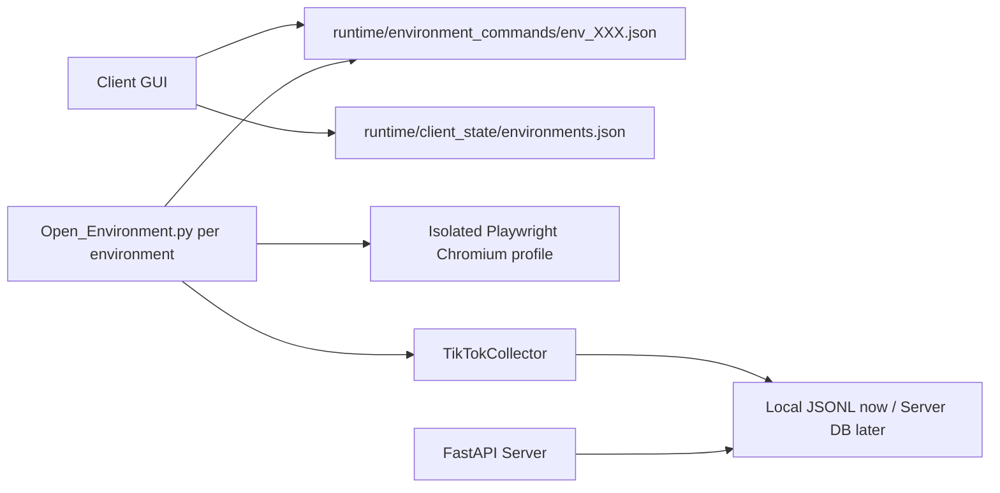

# TK AI CRM Production Refactor Plan

## Current Problem Summary

1. Two browser windows can show the same TikTok login state when the environment profile has been reused or polluted by an old login.
2. System Chrome and Edge are not suitable as the primary production browser runtime because they can be confused with the user's normal browser processes.
3. Each environment must own one isolated Playwright persistent profile directory and one bound TikTok account.
4. If the bound TikTok account changes, the browser profile must be rebuilt or the old cookies will keep the previous login.
5. Collection tasks must run inside the already-open environment process. Starting a separate worker against the same profile can cause lock conflicts and account confusion.

## Production Runtime Model

## Development Phases

1. Environment isolation
   - Use Playwright-managed Chromium first.
   - Keep one profile directory per environment.
   - Rebuild profile when account binding changes.
   - Close environment processes when the client exits.

2. Collection task runner
   - GUI writes task command file.
   - Environment process executes the task inside its own browser.
   - Collector supports recommendation and hashtag modes.
   - Collector stores users, videos, and logs locally.

3. Data query
   - GUI reads collected users from local JSONL.
   - FastAPI exposes users, videos, and task logs.
   - Later replace JSONL with MySQL 5.0 repositories.

4. Production server deployment
   - FastAPI API service.
   - Worker service.
   - External MySQL 5.0 database.
   - Redis Cluster in k3s.
   - k3s deployment manifests.

5. AI filtering
   - Video relevance filter.
   - Public profile business-signal filter.
   - Qualified / review / unqualified user buckets.

6. Inbox listener and AI reply
   - Monitor messages and notifications.
   - Pause collection when replies arrive.
   - AI reply runs as a separate maintainable module.
